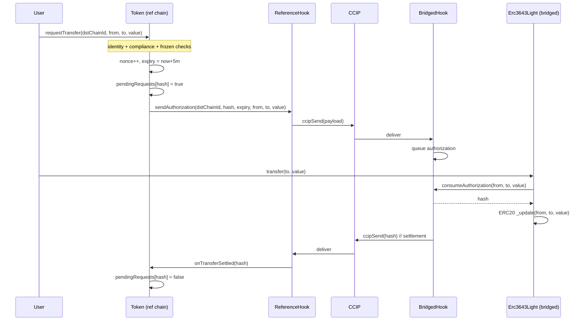

# Reference-Chain `requestTransfer` & Hook System — Design

**Date:** 2026-04-14
**Status:** Approved (pending user review of this document)
**Affects:** `erc3643` (this repo, reference chain) + `erc3643-cc-light` (bridged chain)

## 1. Background

The ERC3643 cross-chain-light protocol splits responsibilities between two chains:

- **Reference chain** (this repo) — single source of truth for compliance and identity. Holds the full T-REX stack (`IdentityRegistry`, `Compliance`, etc.).
- **Bridged chain** (`erc3643-cc-light`) — holds an ERC20-style token (`Erc3643Light`). Local transfers on the bridged chain are gated by an authorization that originates from the reference chain.

The bridged-chain side already exists. Per the `erc3643-cc-light` README, when a user wants to transfer tokens **on the bridged chain**, the flow is:

1. User calls `requestTransfer(from, to, value)` on the **reference chain** Token.
2. Reference chain evaluates compliance, ships an authorization message to the bridged-chain hook via cross-chain messaging.
3. User then calls `transfer(to, value)` on the bridged-chain `Erc3643Light`. The bridged-chain hook validates the authorization; the ERC20 transfer settles locally.
4. Bridged chain ships a settlement notification back to the reference chain, which clears the pending state.

**Important framing:** No tokens move cross-chain. The reference-chain Token is *only* a compliance oracle for transfers that happen entirely on the bridged chain. `requestTransfer` produces a time-bound authorization; it never touches reference-chain balances.

This document specifies (a) the additions to the reference-chain `Token` and the new reference-side hook system, and (b) the breaking changes required in `erc3643-cc-light` to consume the new authorization payload.

## 2. Goals & non-goals

**Goals**

- Add `requestTransfer` to the reference-chain `Token`, callable by anyone, performing the same compliance checks as `transfer()`.
- Build a reference-side cross-chain hook system (interface + abstract base + Chainlink CCIP implementation) symmetric with the bridged side.
- Define a hash format that is replay-safe across chains and across repeated identical transfers.
- Refactor the bridged-chain hook to look up authorizations by `(from, to, value)` so the bridged-chain token does not need to know nonces or expiries.
- Ship coordinated changes to both repos.

**Non-goals**

- Moving balances between chains. There is no token bridge.
- Cleaning up expired pending entries on the reference chain (acceptable to leave them; can add a pruner later).
- Updating compliance state on the reference chain when authorizing — no transfer happens here.
- Supporting `transferFrom`-style requests where a spender consumes allowance. Anyone can request; bridged-chain `transfer()` still enforces ownership.

## 3. Hash format

```
hash = keccak256(abi.encode(dstChainId, from, to, value, nonce, expiry))
```

- **`dstChainId`** — the bridged chain on which the transfer will execute. From the reference chain it is the destination; from the bridged chain it is `block.chainid`. Prevents an authorization from being replayed on a different bridged chain.
- **`nonce`** — auto-incrementing per `from`, allocated by the reference-chain Token at request time. Lets `(from, to, value)` repeat without the two requests collapsing to the same hash.
- **`expiry`** — `block.timestamp + 5 minutes` at request time. Committed to the hash so it cannot be silently extended in transit.

`HashLib` lives in both repos and must produce the same hash given the same inputs.

## 4. Reference-chain changes (this repo)

### 4.1 `Token` additions

```solidity
function requestTransfer(uint64 dstChainId, address from, address to, uint256 value)
    external
    whenNotPaused
    returns (bytes32 hash);
```

Behavior:

1. Check `from` and `to` are not frozen (mirrors `transfer()`).
2. Check `identityRegistry.isVerified(to)` and `compliance.canTransfer(from, to, value)`. Revert with `TransferNotPossible` otherwise.
3. Allocate `nonce = nextNonce[from]++`.
4. Compute `expiry = uint64(block.timestamp) + AUTHORIZATION_TTL` where `AUTHORIZATION_TTL = 5 minutes` (constant).
5. Compute `hash = HashLib.hash(dstChainId, from, to, value, nonce, expiry)`.
6. Set `pendingRequests[hash] = true`. Revert if already set (defensive; should be unreachable thanks to nonce).
7. Call `hook.sendAuthorization(dstChainId, hash, expiry, from, to, value)`. The hook needs the `(from, to, value)` triple in addition to the hash because the bridged-chain hook will index authorizations by that triple.
8. Emit `TransferRequested(hash, dstChainId, from, to, value, nonce, expiry)`.

`requestTransfer` does **not** call `compliance.transferred` and does **not** touch any balance state.

```solidity
function onTransferSettled(bytes32 hash) external;
```

Called by the reference-side hook when a settlement notification arrives. Restricted to the `HOOK` role (AccessManager). Clears `pendingRequests[hash]` and emits `TransferSettled(hash)`. No-op if the entry is already cleared.

```solidity
function setHook(address newHook) external;
```

Restricted to `HOOK_MANAGER`. Stores the hook address and emits `HookSet`.

**Storage additions** (extend the existing `TokenStorage` ERC-7201 struct, no new namespace):

```solidity
mapping(address from => uint256) nextNonce;
mapping(bytes32 hash => bool) pendingRequests;
address hook;
```

Adding fields to the existing struct is layout-safe for upgradeable contracts as long as they are appended.

**Interface placement:** `requestTransfer`, `onTransferSettled`, and `setHook` are added to `IToken` (per Q4). They are reference-chain-specific so they do **not** belong in `IERC3643`.

### 4.2 Hook system

Mirrors the cc-light layout in this repo.

**`IReferenceCrossChainHook`** — minimal token-facing interface:

```solidity
interface IReferenceCrossChainHook {
    function sendAuthorization(
        uint64 dstChainId,
        bytes32 hash,
        uint64 expiry,
        address from,
        address to,
        uint256 value
    ) external;
}
```

Settlement notifications are received via the underlying transport (CCIP receiver) and dispatched to the token through `Token.onTransferSettled` — they are not part of the public hook interface.

**`AbstractReferenceCrossChainHook`** — base class:

- Stores `IToken token`.
- `sendAuthorization` is restricted to the `TOKEN` role.
- Provides `_onSettlement(bytes32 hash)` template method that calls `token.onTransferSettled(hash)`. Subclasses invoke this from their transport-specific receive path.

**`ChainlinkReferenceCrossChainHook`** — concrete implementation:

- Extends `AbstractReferenceCrossChainHook` and `CCIPReceiver`.
- Holds an admin-managed mapping `dstChainId => bytes32 bridgedHookAddress` (the CCIP-encoded counterpart hook address per destination chain). Setter restricted to a hook-admin role.
- `sendAuthorization` ABI-encodes `(hash, expiry, from, to, value)` and ships it to `bridgedHookAddress[dstChainId]` via `IRouterClient.ccipSend`. Reverts if the destination is not configured.
- `_ccipReceive` decodes incoming settlement notifications (`bytes32 hash`) and calls `_onSettlement(hash)`. Validates the source chain selector and sender against the same per-chain mapping.

### 4.3 Roles

Add to the existing access-manager role wiring:

| Role | Function | Holder |
|---|---|---|
| `HOOK_MANAGER` | `Token.setHook` | governance |
| `TOKEN` | `Hook.sendAuthorization` | the Token contract |
| `HOOK` | `Token.onTransferSettled` | the configured hook contract |

Roles are added to `contracts/libraries/RolesLib.sol` and the existing role-wiring helper `contracts/libraries/AccessManagerSetupLib.sol` is extended to bind them.

### 4.4 Errors & events

New custom errors in `ErrorsLib`:

- `HookNotSet()`
- `RequestAlreadyPending(bytes32 hash)`
- `UnauthorizedHookCaller()` (CCIP receiver guard)
- `DestinationChainNotConfigured(uint64 dstChainId)`

The existing `TransferNotPossible()` is reused for the compliance/identity reject path in `requestTransfer`.

New events in `EventsLib`:

- `TransferRequested(bytes32 indexed hash, uint64 dstChainId, address indexed from, address indexed to, uint256 value, uint256 nonce, uint64 expiry)`
- `TransferSettled(bytes32 indexed hash)`
- `HookSet(address indexed hook)`
- `BridgedHookConfigured(uint64 indexed dstChainId, bytes32 bridgedHookAddress)`

## 5. Bridged-chain changes (`erc3643-cc-light`)

These are breaking. They ship in lockstep with the reference-chain change.

### 5.1 `HashLib`

Replace:

```solidity
function hash(address from, address to, uint256 value) internal pure returns (bytes32);
```

with:

```solidity
function hash(
    uint64 dstChainId,
    address from,
    address to,
    uint256 value,
    uint256 nonce,
    uint64 expiry
) internal pure returns (bytes32);
```

Implemented with `keccak256(abi.encode(...))` (or `EfficientHashLib.hash` if it supports the wider arity; otherwise plain `abi.encode` is fine — this is not a hot path).

### 5.2 `ICrossChainHook`

Replace:

```solidity
function isTransferAuthorized(bytes32 hash) external view returns (bool);
function onTransfer(bytes32 hash) external;
```

with:

```solidity
function consumeAuthorization(address from, address to, uint256 value)
    external
    returns (bytes32 hash);
```

Semantics:

- Looks up the oldest non-expired authorization matching `(from, to, value)` for the local chain.
- If found, marks it consumed, returns the matching `hash`.
- If none found (no authorization, or all matches expired), reverts with `TransferNotAuthorized()`.
- Triggers the outbound notification (the bridged → reference settlement message) for the consumed `hash` before returning.

The previous two-step `isTransferAuthorized` then `onTransfer` collapses into a single call. The token does not need the hash for any other purpose.

### 5.3 `AbstractCrossChainHook`

Storage replaces the prior request-status mapping with:

```solidity
struct Authorization {
    bytes32 hash;
    uint64 expiry;
    bool consumed;
}

// Per-(from,to,value) FIFO of pending authorizations.
mapping(bytes32 key => bytes32[] hashes) authorizationQueue;
mapping(bytes32 hash => Authorization) authorizations;
```

where `key = keccak256(abi.encode(from, to, value))`.

- `_recordAuthorization(bytes32 hash, uint64 expiry, address from, address to, uint256 value)` (called by the transport `_ccipReceive` path) appends to the queue and stores the `Authorization`. Reverts if the hash already exists.
- `consumeAuthorization(from, to, value)` (TOKEN role): pops from the head of the queue, skipping any entries whose `expiry < block.timestamp` or that were already consumed (defensive). Returns the surviving hash and marks it consumed. Calls `_sendSettlement(hash)` template method (subclasses ship the cross-chain notification).
- Expired entries are left in the mapping; popping them off the queue head during `consumeAuthorization` is sufficient cleanup for the queue ordering. (Optional: a public `prune` helper can be added later.)

### 5.4 `ChainlinkCrossChainHook`

- `_ccipReceive` decodes the new payload `(bytes32 hash, uint64 expiry, address from, address to, uint256 value)` and calls `_recordAuthorization`.
- `_sendSettlement(bytes32 hash)` ships the notification (just the hash) back to the reference chain. The destination address is the configured reference-side hook.

### 5.5 `Erc3643Light.transfer` / `transferFrom`

Replaces the current two-call pattern:

```solidity
require(hook.isTransferAuthorized(hashLib.hash(from, to, value)));
super._update(...);
hook.onTransfer(hash);
```

with a single call:

```solidity
hook.consumeAuthorization(from, to, value);
super._update(from, to, value);
```

The hook performs the lookup, marks the authorization consumed, and ships the settlement notification atomically with the transfer.

### 5.6 Roles

The bridged-chain `RolesLib` keeps `TOKEN` (now used to gate `consumeAuthorization` on the hook). The previous `onTransfer` role wiring is removed in favor of the same `TOKEN` role on the merged entry point.

## 6. End-to-end flow (updated)



## 7. Testing strategy

**Reference chain (this repo):**

- Unit tests for `requestTransfer`: success path, frozen `from`, frozen `to`, unverified `to`, compliance reject, paused token, hook not set, multiple concurrent requests for the same `(from, to, value)` (asserting different hashes via nonce).
- Unit tests for `onTransferSettled`: only callable by hook role, idempotent, clears state.
- Unit tests for `setHook`: role-gated, emits event.
- Hook unit tests: `sendAuthorization` role gating, destination-not-configured revert, payload encoding round-trip, settlement reception path (with mocked CCIP router and chainlink-local where applicable).

**Bridged chain (`erc3643-cc-light`):**

- Existing unit tests for `Erc3643Light.transfer` updated to reflect single-call hook flow.
- New hook tests: queue ordering FIFO, expired entries skipped on consume, duplicate-hash rejection on receive, settlement notification emitted.
- Existing fork-based CCIP integration test updated end-to-end with the new payload.

**Cross-repo:** No automated cross-repo test harness exists. Manual verification: the new `HashLib` in both repos must produce identical output for the same inputs (covered by unit tests with hard-coded vectors in both repos).

## 8. Open items & deferred work

- **Pending-state pruning on the reference chain.** Expired entries in `pendingRequests` are never cleaned up. Acceptable for now (storage cost is bounded per user and writes are infrequent). Add a `prunePending(bytes32[])` helper in a follow-up if it becomes a concern.
- **CCIP fees / payment token.** The reference-side hook needs to pay CCIP fees when sending the authorization. Existing cc-light hook handles this for the bridged side; mirror the same approach (LINK token funded on the hook contract, withdrawal restricted to admin).
- **Replay across re-deployed token contracts.** The hash does not commit to the token contract address. If the bridged-chain token is redeployed at a new address, old authorizations could in principle be replayed against the new instance. Acceptable in v1 (token addresses are stable); could be addressed by adding `address(this)` from the reference side and the configured token address from the bridged side to the hash if needed.
- **Multiple bridged chains.** The design supports it via `dstChainId` in the hash, but the reference-side hook only configures one peer per chain selector. Multi-bridged scenarios are not exercised in tests in this iteration.

## 9. Summary of changes

**This repo (`erc3643`):**

- `contracts/token/Token.sol` — add `requestTransfer`, `onTransferSettled`, `setHook`, storage extensions.
- `contracts/token/IToken.sol` — interface additions.
- `contracts/hooks/IReferenceCrossChainHook.sol` — new file.
- `contracts/hooks/AbstractReferenceCrossChainHook.sol` — new file.
- `contracts/hooks/ChainlinkReferenceCrossChainHook.sol` — new file.
- `contracts/libraries/HashLib.sol` — new file (or extend if present).
- `contracts/libraries/ErrorsLib.sol`, `EventsLib.sol`, `RolesLib.sol`, `AccessManagerSetupLib.sol` — additions.
- Tests under `test/unit/` and `test/integration/`.

**`erc3643-cc-light`:**

- `contracts/libraries/HashLib.sol` — new signature.
- `contracts/hooks/ICrossChainHook.sol` — replace two-call interface with `consumeAuthorization`.
- `contracts/hooks/AbstractCrossChainHook.sol` — queue-based storage and consume logic.
- `contracts/hooks/ChainlinkCrossChainHook.sol` — payload decode/encode updates.
- `contracts/Erc3643Light.sol` — transfer flow uses `consumeAuthorization`.
- Tests updated; new tests for queue / expiry behavior.
